# Drusniel: Gods' End Demo

A third-person exploration demo running in the browser on Three.js `WebGPURenderer`, with TSL node materials and a WebGL 2 fallback. The setting and lore are based on [drusniel.com](http://drusniel.com/).

Open meadows of wind-driven grass, with thousands of individually animated blades around the player.

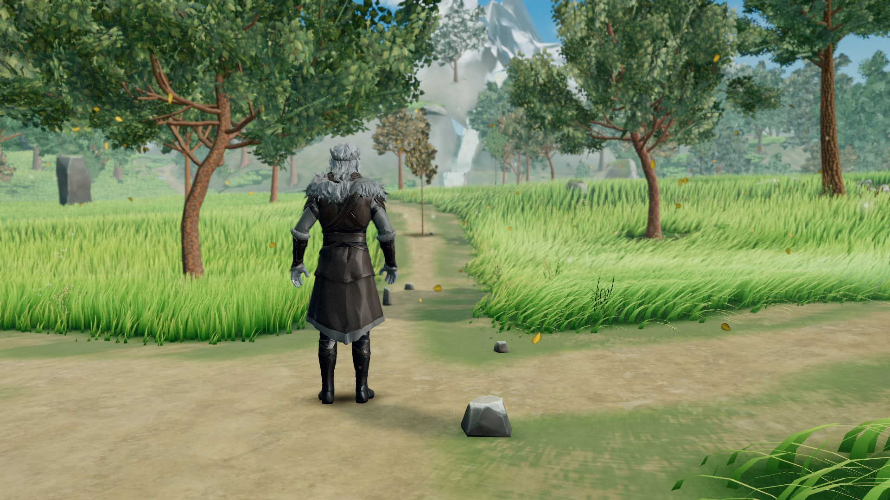

A medieval village of procedurally built timber-framed houses set in tall grass.

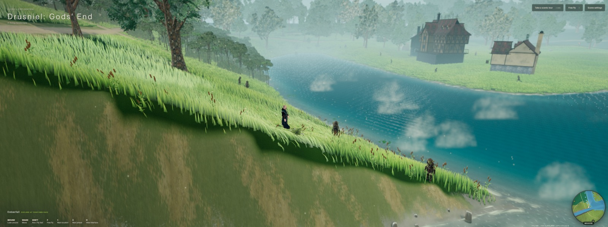

Another view of the village, with stone towers rising above the grassy slopes.

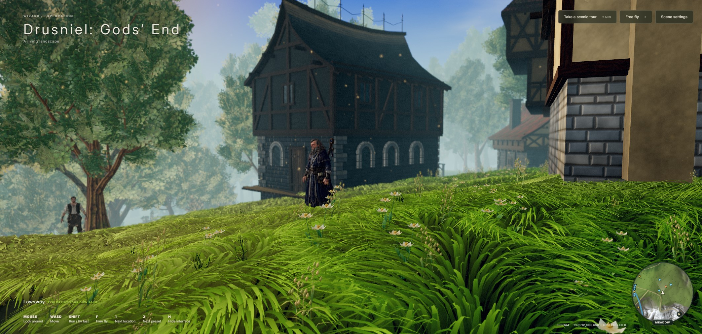

A mountain-fed waterfall dropping into the river, with spray and mist.

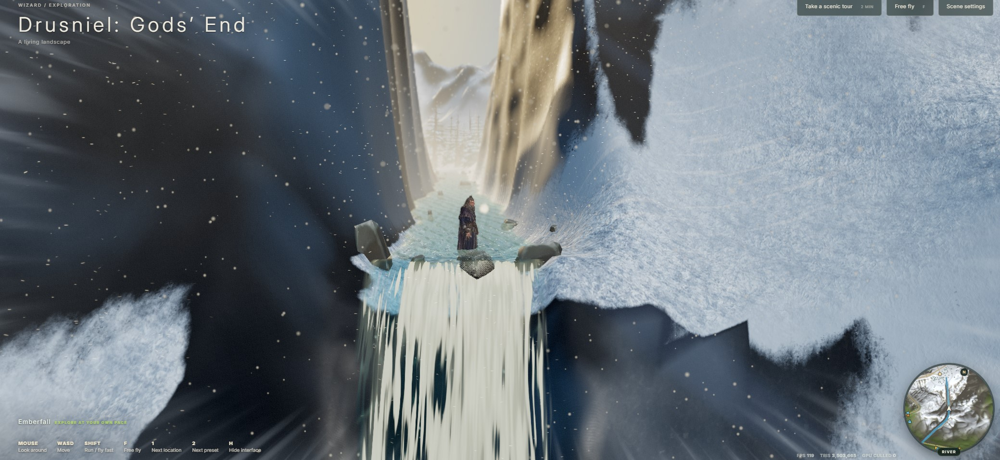

A dense coastal jungle of palms, ferns and understory, layered from the forest floor up to the canopy.

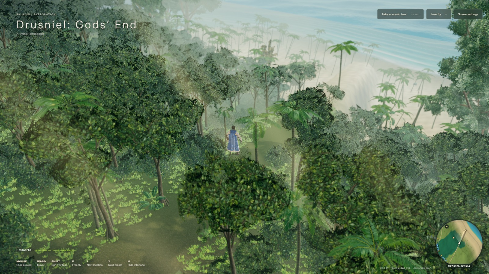

A tropical beach where the surf breaks on the sand before the water deepens into open sea.

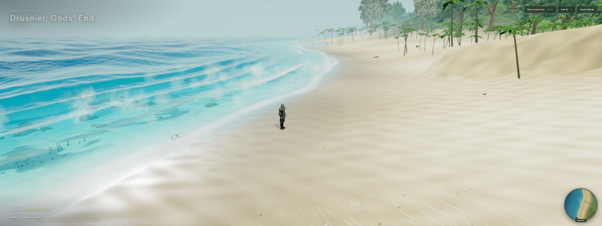

A second coastal view across turquoise water toward the palm-lined shore.

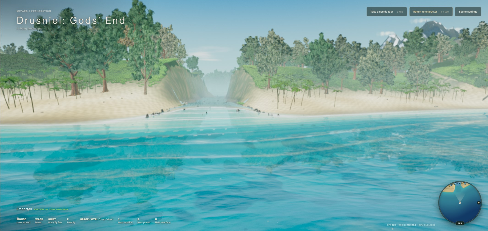

A quiet inland lake surrounded by grassy banks and trees.

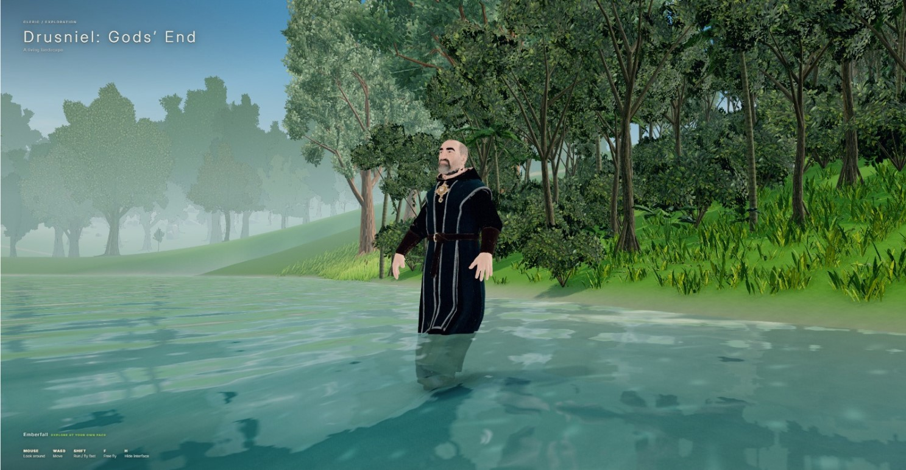

Under the lake, with depth fog, caustic light and the surface seen from below.

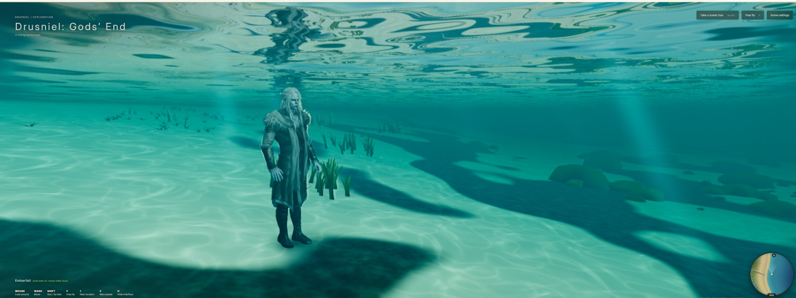

The meadow after dark, lit by the night sky.

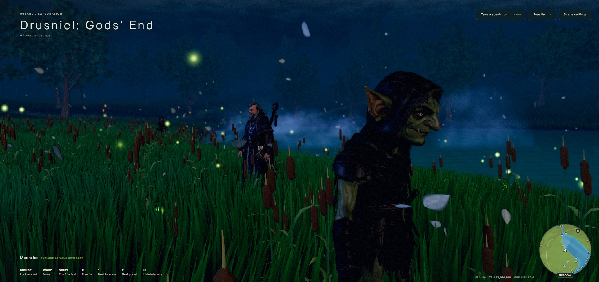

Rain falls over the landscape under an overcast sky.

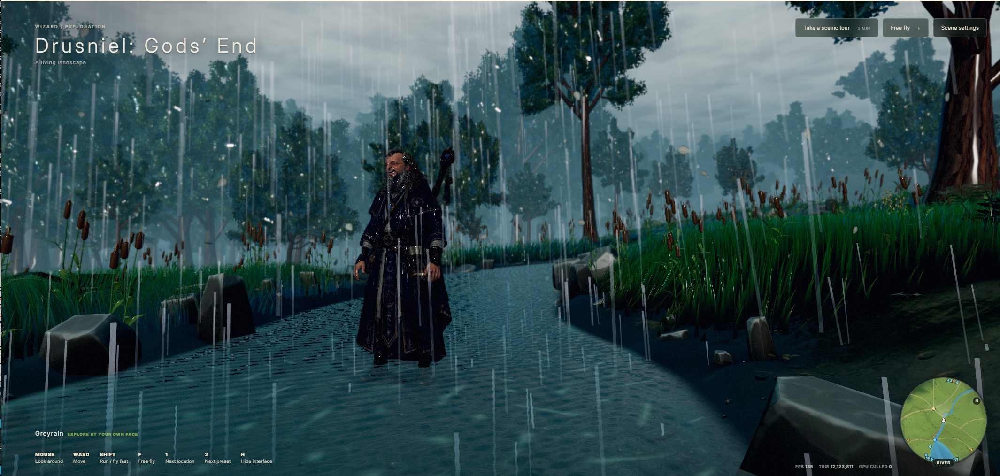

Snow-covered mountain terrain provides a colder region to explore.

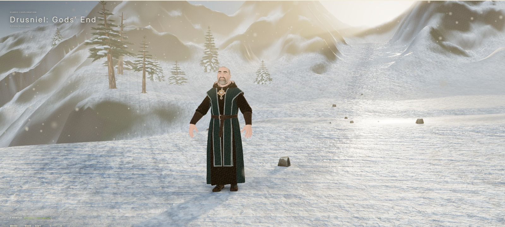

If you want to support the project, [join the Discord](https://discord.gg/pNfJPWprgB), contribute, and star/vote for it on GitHub. The long-term goal is an open-source RPG built on this base, combining [Azgaar's Fantasy Map Generator](https://azgaar.github.io/Fantasy-Map-Generator/) for world generation with Tiny Glade-style procedural building for future releases.

The world is a 2,400 × 1,600 landscape with a mountain-fed river, an inland lake, forest trails, a medieval village, rocky uplands, snowy summits, a coastal jungle and an eastern beach running out to deep sea. A scenic tour visits the main regions.

## Features

- Camera-centred tiled grass with distance LODs, far billboards and persistent player interaction
- Four grass silhouettes (Slender, Reed, Broadleaf, Tufted) across two render families
- Instanced trees with high-detail foliage, rebaked distant impostors and shadow proxies
- Biome vegetation: meadow, alpine, coastal jungle and beach, with baked vegetation LODs
- River, lake and sea water with planar reflections, refraction, shoreline foam and waterfall mist
- Snow terrain with analytic fine relief, footprints and a snow-surf wake
- Procedural sky, cloud plane, rain with wet materials, and per-biome ambient particles
- Seven environment presets (Highfield, Emberfall, Greyrain, Galewind, Stillmeadow, Lowsway, Moonrise)
- Cinematic lighting and grading pipeline with Performance, Balanced, High and Ultra quality levels
- Selectable characters, wandering NPCs, birds and giant serpents
- Rapier character capsule and terrain collision
- Region ambience, one-shot wildlife sounds and surface-aware footsteps
- Config validation, lifecycle cleanup and GPU-loss recovery

## Getting started

Requires Node.js 20 or newer and a browser with WebGPU (WebGL 2 is used otherwise).

```bash
npm ci
npm run dev
```

`npm run dev` and `npm run build` first generate the runtime config bundle, the Basis transcoder, the baked terrain and the scene preprocessing data.

```bash
npm run lint
npm test
npm run build
npm run preview
```

## Controls

```text
WASD        move
Shift       sprint / fly fast
Shift x2    toggle fast exploration movement
F           toggle free-fly mode
Space       fly up
Ctrl        fly down
Esc         exit free-fly / scenic tour
Click       pointer lock and audio unlock
Mouse       look while the pointer is locked
Wheel       camera zoom
```

Mobile uses on-screen movement and look controls. The scene menu has teleports to Start, River, Lake, Village, the beaches, the coastal jungle, the snow pass and summits, Offshore and Deep Sea.

## Credits

- Snow shading, relief and wake are adapted from [Snowflow](https://github.com/Noniv/snowflow_demo) by Maksymilian Dendura (MIT).
- Snow textures from [ambientCG](https://ambientcg.com) (CC0).
- Sound effects are CC0 / public-domain recordings; sources and licences are listed in `public/Assets/Audio/CATALOG.md`.
- The Inter typeface is used under the SIL Open Font License (`public/Assets/fonts/Inter-LICENSE.txt`).
